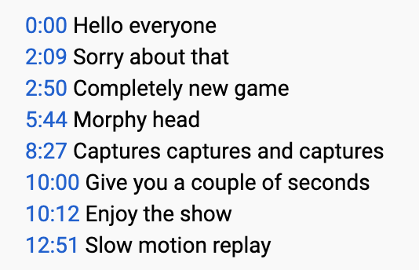
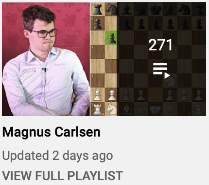

# Agadmator

This project is created in honour of our beloved [Agadmator](https://www.youtube.com/channel/UCL5YbN5WLFD8dLIegT5QAbA).

After seeing many comments listing timestamps of Agadmator's phrases, I decided that it'd be fun to make a compilation of all
Agadmator's phrases such is *Hello everyone*, *Sorry about that*, *It was in this position* and many others.



## Installation

Create and install a virtualenv:
```bash
> virtualenv venv
> source venv/bin/activate
```

Install dependencies
```bash
> pip install -r requirements.txt
```

To quit the virtualenv use:
```bash
> deactivate
```

## Usage

1. Choose a playlist on [Agadmator's channel] that you want to download.
2. Click on **VIEW FULL PLAYLIST** under the video's title and copy the link of the page. 
3. Download videos and subtitles by running `> python download.py --url=<playlist_url>`, 
for example `python download.py --url=https://www.youtube.com/playlist?list=PLDnx7w_xuguGMjiY15vAilL8fon03tbOC`.
4. Optional: goto 1 and download other playlists.
5. Generate a compilation of your favorite Agadmator's phrase by running `> python process.py --phrase=<"your phrase">`.
It will appear in `compilations/` directory.

## List of phrases

* "hello everyone"
* "sorry about that"
* "completely new game"
* "captures captures and captures"
* "give you a couple of seconds"
* "enjoy the show"

## License

[MIT](LICENSE)